# SRS Simulations

## Rationale for this simulation

Anki allows the user to change a crucial parameter in the spaced repetition algorithm.
As you may know, intervals (delay between revisions) can get modified by an Interval Modifier (IM).

The Interval Modifier and the Retention Rate have a precise mathematical relation.
This relation is often used by Anki users to adjust their retention rate.

The relation between the quantity of work and these two variables is less clear. One can be tempted to try large IM's in order to have less work, but as failed cards got an (almost) hard reset, this strategy may or may not backfire by asking the user even more work.

Efficiency is a concept that has its importance in this context. A user who has not a limited set of cards to learn may want to optimize his ratio overall retention rate/work. If he spends less time reviewing, he can spend more on learning new things. 

**Are there Interval Modifiers that optimizing Efficiency?**

In the rest of the article, I won't always restate that we are in the context of efficiency searching, so: better=more efficient.

If you are a techy, you can reproduce the simulations by using workload_simulation.py (have a look on the readme.md) and reproducing the analysis with the jupyter notebook analysis.ipynb.

## Glossary

**Workload** : Average number of reviews during the simulation. Workload related to the card creation is counted as its equivalent in number of reviews (e.g creating a card takes nth more time to review a card, with n being a parameter of the simulation).

**New Card Cost** : How many cards can be reviewed instead of entering a new card in the system for the same lenght of time. Considered to be 0 for pre-made decks.

**Success Rate** : Probability of answering "yes" at card. Supposed to be constant during a single simulation. This is often called retention rate, but I reserve this term to another meaning.

**Retention Rate** : Average success rate if the user was tested at **any random moment** during the simulation. This metric has several advantages over success rate, the main one being that this is more related to real life outcomes. As stated earlier, this is different from the classical definition of retention rate.

**Efficiency** : Retention Rate / Workload

**Factor** : The constant responsible for the spacing (Interval2 = factor * Interval1). Supposed to be constant during a single simulation.

**IM** : Interval Modifier. The ratio between two factors. By default, this relates to SM2 default factor (2.5). IM = newfactor/2.5

**Period of investigation** : Average length of a simulation (the number of days the card history is tracked). Also called life expectancy of a card.


## Key results

First of all, this is important to know that these results are valid under a set of assumptions. The main one being that the SM2 memory model is right. I think you should have a look on the section "Assumptions and Simplifications" before changing your IM.

- **Except for cards with low success rate, SM2 efficiency can be significantly improved**.

- All the improvements are done with an increasing of IM from its standard 100% with the strategy of reducing workload at the cost of retention. Whatever the initial success rate or other parameters. Retention loss is almost always bounded from 0 to 6pt and workload reduction have a much large range from -5% to -55%. 

- Applying a lower IM (< 100% ) in order to target a higher retention rate comes with a very high cost for the workload, and low gain on retention. Accross all parameter space, not a single point have been found where setting IM below 100% was a good choice compared to its standard 100%.

- The value of optimized IM's depends on various factors like the cost of new card, lenght of the simulation but the most important one (to a large extent) is the initial success rate.

- The larger the success rate, the larger the IM and the larger the efficiency improvement gained after optimization.

- When increasing IM, Workload has an U shape while retention is (almost) a straight line. This means that very large IMs can provide both more work AND less retention than optimal IMs. Increasing IM can provide much improvement in terms of efficiency, but that should not be done recklessly.

- In contrast to the previous point, from the angle of efficiency, it's more damaging to set a lower IM than an higher IM, even for these absurds points where both retention and workload are higher. The reason for that is that the U shape of workload is quite asymetric, it decreases fast until the optimal point then increase at moderate rate (cf some of the following plots).

- The efficiency optimum is very close to also provide the least amount of work possible.


## Specific results

### Premade-decks for lifelong cards

#### Global Patterns

Hyperparameters :

- Decks are premade (no cost to entering a new card in the system).
- Average length of simulation (deletion of card by the user) : 30 years.

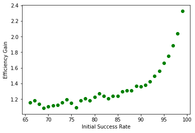
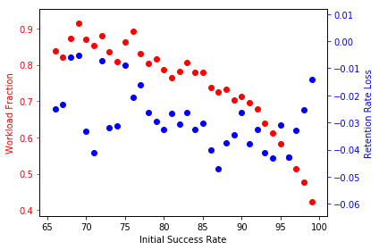
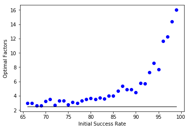

Optimal IMs and their outcomes are very sensitive to the user default success rate. Interestingly enough SM2 is closed to the optimal choice for cards that have an initial success rate below 75%. 


#### 70% success rate

Even for low success rates, a small IM of 130% can grant better efficiency. Note that in this case, the efficiency gain is small : around +1.5% of efficiency (trading 12% of workload against 2.5pt loss of retention rate).

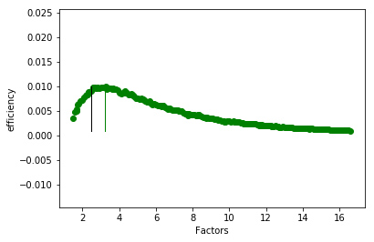
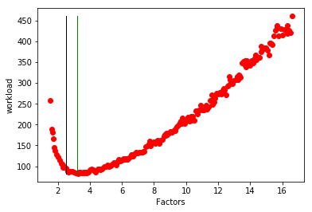
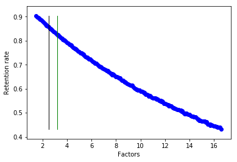

With this result and with these curves in mind. It would be quite ill-advised to set an IM targeting higher success rates. For this specific example, setting an IM that would promise a success rate of 81% coming from a current success rate at 70% would have **large detrimental effect on the workload** (+273%) and efficiency (-61%). 

```
           |factor| pbt  | ret  | load  | effi
   SM2     | 2.50 | 0.70 | 0.86 | 94.37 | 0.01
---
User Defined Factor
 Absolute  | 1.50 | 0.81 | 0.90 | 257.18 | 0.00
  VS SM2   | 0.60 | 0.11 | 0.05 | 2.73 | 0.39
```

The two firsts lines are absolute values, and the last one compare these values such as :

- pbt: success rate difference
- ret: retention rate difference
- load: workload improvement workload_new/workload_before
- effi : efficiency improvement (eff_new/eff_before)

On this plot the green line does not represent the optimized IM, but IM=0.6.

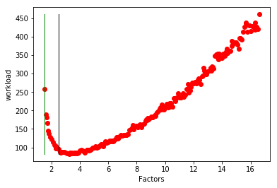

#### 90% success rate
The picture is quite different for cards with larger success rates :

- For the "default" 90% success rate. the optimized IM is at 180%. At the cost of -3 points in retention, workload is decreased by 29%.

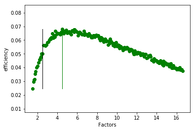
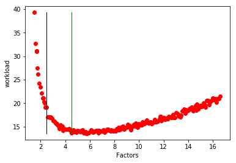
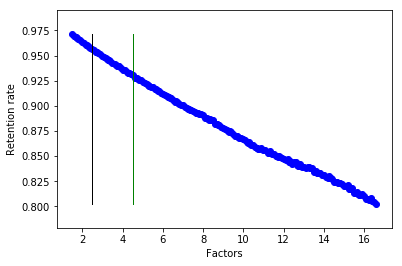

```
           |factor| pbt  | ret  | load  | effi
   SM2     | 2.50 | 0.90 | 0.96 | 19.12 | 0.05
---
Max Eff
 Absolute  | 4.50 | 0.83  | 0.93  | 13.64| 0.07
  VS SM2   | 1.80 | -0.07 | -0.03 | 0.71 | 1.36
```

#### 95%

- For a 95% success rate, the optimized IM at 300%. It also cost -3 points in retention for a workload decreased by 42%.

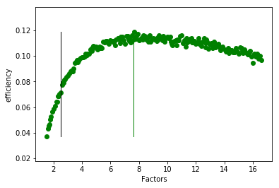

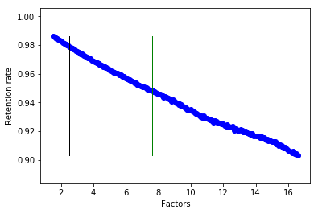

```
           |factor| pbt  | ret  | load  | effi
   SM2     | 2.50 | 0.95 | 0.98 | 13.72 | 0.07
---
Max Eff
 Absolute  | 7.67 | 0.85 | 0.95 | 7.99 | 0.12
  VS SM2   | 3.07 | -0.10 | -0.03 | 0.58 | 1.66
```

### Under different parameters

While the shape of the previous curves stay basically the same, different parameters can have a certain impact on the final results.

#### Length of simulation

Let's say that cards have now a life expectancy of one year. Optimized IM tends to be larger and provide even better efficiency gain compared to SM2.

We have these results :

```
    |  IM  | pbt   | ret   | load | effi
70% | 1.52 | -0.12 | -0.06 | 0.82 | 1.14
90% | 2.68 | -0.15 | -0.05 | 0.66 | 1.43
95% | 4.36 | -0.15 | -0.05 | 0.56 | 1.70
```


#### Self Made Cards

All the previous results only hold for pre-made decks. This has entered the simulation because it's important to have the relation `total_workload = nb_cards * card_workload` correct.

Unsurprisingly, considering a cost of card creation reduce efficiency gains, especially for cards with low life expectancy. But does it change the value of optimized IM ?

Results for newcardcost = 8 reviews, and length simulation = 1 year

```
    |  IM  | pbt   | ret   | load | effi
70% | 1.16 | -0.04 | -0.02 | 0.90 | 1.08
90% | 2.10 | -0.10 | -0.03 | 0.83 | 1.16
95% | 3.68 | -0.12 | -0.04 | 0.79 | 1.21
```

Optimized IM are lower, as there is less incentive to take risk on reducing the workload.

When the life expectancy is higher (30 years), the extra workload tends to be averaged away. The results are very close the first results presented.

```
    |  IM  | pbt   | ret   | load | effi
70% | 1.30 | -0.07 | -0.03 | 0.88 | 1.09
90% | 1.80 | -0.07 | -0.03 | 0.80 | 1.22
95% | 3.07 | -0.10 | -0.03 | 0.74 | 1.32
```


## How to use this work to optimize your IM with your parameters

You may want to pick your new IM with the following parameters : card life expectancy, success rate, new card cost. Sadly, I have not plug&play way to give you something easy to use.

At the current state of this repository you can only rely on the previously presented data and these four curves to guide your choice of IM :

- [30y cost 0](./images/all_factors_30y_0c.png)
- [30y, cost 8](./images/all_factors_30y_8c.png)
- [1y, cost 0](./images/all_factors_1y_0c.png)
- [1y cost 8](./images/all_factors_1y_8c.png)

On the jupyter notebook (analysis.ipynb), you have nice widgets allowing you to set your parameters and get your curves and numerical results. But that would require you to install python3.7, jupyter and ipywidgets. There is also a potential problem with the datafiles produced by the simulation which are not really made to be shared accross multiple environnement. So you may have to run the simulation yourself if that does not work.

You can also send me your parameters via PM: success rate, card life expectancy (1y, 5y or 10y), cost of creating a new card and I can send you the results.

The best would be to fit the curves and make them work on a static webpage to reproduce the effects of widgets without having to load simulation data.

## Behind the hood

### How the simulation works

The idea is to follow the path of a single card during more than one year.
We roll the random module to decide whether or not the card is failed and we schedule this card accordingly (Intervals got multiplied by factor).
We run 10 000 simulations for each factor. Factors are chosen as fractions (2.666, 2.75 etc...) in order to have meaningful distinctions (intervals are rounded).
For each simulation we count:
- The number of times the card has been reviewed.
- How well this card has been known over time (with a subtlety, integrals are computed to answer to the question
"If I was interrogated at any time during the investigation period, how would have I succeeded ?".).

To compute the workload, a number is added to represent the cost of entering a new flashcard in the system. This number is not really part of the simulation, but rather of the analysis. 

As the success rate of the user has a large impact on the result of the simulations, we ran this whole set of simulations for a range of success rate between 0.70 and 0.98.


### Assumptions and simplifications

SM2 algorithm schedule cards so that they are at X% chance to be succeeded (X depends on the user and his cards so this is a parameter of the model) 

Failed cards are reviewed ASAP then the day after. After that, they retrieve their normal SM2 flow.

The first steps are : 1day, factor days, factor * factor ...etc...

If the interval is a float, its rounded so that it's a number of days

No grading (easy, good etc..). The multiplicative factor stay constant (like only good/fail).

No randomness was added in the scheduling or in the reviewing of the cards.

All reviews represent the same unity of work (whatever the difficulty). It's probable that cards with high success rate are answered faster, this is an important limit. Modeling this effect is a bit hard because I don't have any data to back this up. Note that after optimization, the succes rate of a card is diminished from around 10% (only), I personally don't think that it changes much the time to answer but I may be wrong. Maybe that would be worth to investigate an alternate workload model where a card workload would be modeled as 1 + (1-success_rate) * 2 and see how "more conservative" the optimizations get.

Many of these factors can be changed. If you think that one must be changed or passed as a parameter of the model, tell me, or fork me and PR me. 

Motivation is not taken into account. This is a question that has no absolute answer. Do difficulty motivates you or discourages you? Would like to see your cards less often to the profit of other cards ?

Optimization have been empirically found by taking the "best point". A more robust approach would be to 1/fit the curves 2/takes the best point of the curve.

More efficiency implies more cards, if your cards are somehow linked together, it could strengthen them more and compensate for the retention loss. Or if you prefer being pessimistic, it could bring more interferences and accelerate forgetness.

The current success rate given by the user is exact and is the same for all the cards of the targeted deck. Optimized IM could be a bit different for a deck composed with 10 cards with a 70% success rate + 10 cards with a 90% success rate compared to a deck with 20cards with 80% success rate. That would be the case if optimized IMs was a linear function of success rate, but results show a **very** different picture. Check the contribute part if you want to have ideas on how to solve this problem.


### The problem of the cutoff

Every simulation has an end. In the context of spaced repetition, choosing the end has consequences.
Let say that a static limit at 200 days is chosen. If the card is reviewed just before the 200 days cutoff, the simulation got more workload for not a big increase in retention. Conversely, if the card is planned just before, we have just the opposite effect. I identified multiple ways to counteract this limit. After many trial and errors (see footnote 2). I opted in for a random cutoff following an exponential distribution. Multiple simulations have been made with differents parameters for the mean end of the simulations (1year, 10years, 30years). During the first developpement of the simulation this parameter did not changed much the results, but adding the workload related to the creation of card in the analysis made this parameter more important.


## Against the U-Shaped workload

This is not really a symetric U, but you get the idea.
With a thousand feets view, this result is weird. As a user, you should always be able to trade workload against overall retention.
Is it the side-effect of an algorithm (too) harsh on failed cards? From another angle, reseting cards is fairly counter-intuitive from a cognitive perspective. This goes a bit against the idea that storage strengh has been improved over time. 

So, what if failed cards do not deserve a full reset? I am not the first personn to suggest that of course.
Another simulation is provided with an alternative model where failed cards are less severly punished. A failed card deserve one more review during the same day, and the next interval is a fraction of the previous own (lapse on fail cards). I tried several things (stable interval, divide the interval by two) but that was not harsh enough and very large intervals were suggested by the system. I realized that if the dividing factor was not raising with the current factor, the simulation find "optimizations" for really large factors. I tried to divide by the factor itself (equivalent to go 1 interval back), but the U pattern came back. Finally I went to divide by sqrt(factor) and got a nice shaped curves. This could also be interpreted as "half a step back" since steps have a geometric progression.

Results on optimized IM are not very much different with this new algorithm. For the 1 year simluation on pre-made decks (no cost of new cards) we have the following results :
Optimal IMs are found to be higher than the original study compared to SM2 (also with this new policy on failed cards):
- optimized IM at 230% for success rate for 70% difficulty -8pt retention, -25% workload.
- optimized IM at 370% for success rate for 90% difficulty -7pt retention, -40% workload.
- optimized IM at 580% for success rate for 95% difficulty -6pt retention, -48% workload.
The shape of the workload happens to be "fixed" ([70%](images/workload_70_after_partial_reset.png), [95%](images/workload_95_after_partial_reset.png))

An user is still able to trade workload against retention (but at an higher and higher cost once he passed through the optimized IM). I don't think the niceness of the curves are a strong argument in favor of this memory model and this strategy. This would be much better to have empirical data on this subject.


### Contribute

The code here is not at production level, there is no tests (shame on me) and you may be put off by the big-fat-loop of the simulations. Sorry about that. 

You may try a to simulate a new model or correct mine or adding parameters or whatever. For some reasons, I am not a good maintainer, so I probably won't be very active on the github repository. But the least I can do is linking to your fork in the README.md

Few ideas :

- Trying other forgetting curves such as the power law.
- Adding a success rate dependent workload as described earlier?
- Fit the curves (I played with polynomial fits which did not work well). Good fits could open up the possibilities of a light interface to allow user pick an IM.
- Making the jupyter notebook more accessible (docker?, documentation?, online version?). These nice widgets of jupyter should be available for everyone.
- Correct my english.
- Caching the results of functions in forgetting_curve.py that are among the responsible for the slowness of the simulations (like with lru_cache).
- Try to model grading buttons (good, easy ...), but I have no idea how.
- Replace pickle files by csv's (for more sharability of the results)
- Kernel Smoothing on curves to account for the variance in success rate (cf point in limits & assumptions). With gaussian smoothing, you acknowledge that success rate is not a constant, but follow a distribution around your estimated success rate. That can represent either your uncertainty on the real success rate or the fact that a deck is composed of cards with different success rate normally distributed around your estimate. As the cost in efficiency is larger for lower IM than for lower IM, I believe that kernel smoothing would point in the direction of even larger optimized IM's. It would also predict less gain in efficiency.


## Some notes

1. The fact that SM2 efficiency can be improved is not new and noted in Piotr Wosniak websites. However he thought that optimization could be done by setting an "efficient" forgetting index. This simulation shows that optimal factors depends largely on the current forgetting index of the user. And that optimized IM are associated with new F.I that vary much (between .90 and .58).

https://www.supermemo.com/help/fi.htm
"It is difficult to determine exactly what forgetting index brings the highest acquisition rate.
Simulation experiments have consistently pointed to the value of 25-30%"

2. The first is to apply bonus or malus on workload or retention rate depending on how far the next review is planned after the cutoff.
For example adding a fraction of review depending on how far the next review is planned provockes a negative effect.
The second is too have a random cutoff.
The first did not solve my problem very much (curves were malformed, and my bonus/malus system were ad'hoc and arguable).

Random cutoff, on the opposite ended up working quite well (with a lot of pain involved though, see the footnote) but that recquires to simulate more to limit the extra variance added the simulation.
After few trials, I picked a radical 'ultra random cutoff' where a single simulation is between 2 months and 4 years (uniform random).
That smoothed well the curve (with still a noticable discrepancy though).
Even with this very large smoothing, sweet spots for factors were still visible and perfectly predictible.
This is problem. At these specific sweetspots were lying the first version of our optimized factors.
That would have saved me some cpu cycles to solve a polynomial expression than running thousands of simulations.

Few plots :

- 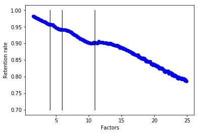
- 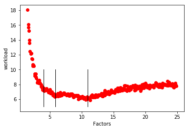
- 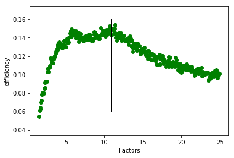

Note that without a random cutoff the curves were even uglier.

This simulation was made for an average simulation length of 4 years. 
Black lines are the results of the solutions of the following equations :

- x^2 + x + 1 = 30 * 12 * 4
- x^3 + x^2 + x + 1 = 30 * 12 * 4
- x^4 + x^3 + x^2 + 1 = 30 * 12 * 4

These were the exact factor allowing the simulation to be absolutely sure to leave in (3, 4 or 5 steps).
Increasing the factor after these spots brings no benefit because the simulation won't leave in less steps the investigation period, but get more chances to get a card failed.

I changed the uniform random for a gaussian random (normal distribution) hoping to get more smoothing, which apparently made things worse.
At this point, I almost raged quit this simulation project.
Then I changed to an exponential distribution. And FINAL-FUCKING-LY, it gave something smooth.
I believe this is a not a bad model. Each day passing, you have the same probability to get rid of your card.
